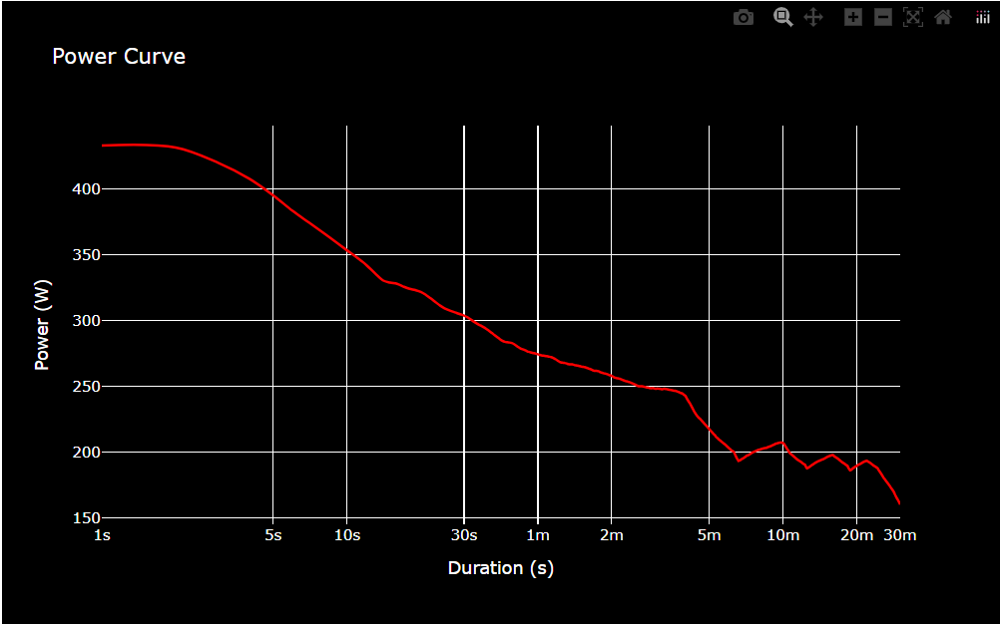

# Leistungskurve II
von Laurence und Jan :)

## Beschreibung

Diese Anwendung liest Aktivitätsdaten aus einer CSV-Datei ein, berechnet daraus eine Power Curve und visualisiert diese als interaktives Diagramm.

Die Power Curve zeigt die höchste durchschnittliche Leistung für verschiedene Zeitfenster und ist ein wichtiges Werkzeug zur Analyse von Leistungsdaten im Ausdauersport.

## Voraussetzungen

* Python 3.14
* PDM

## Projekt starten

Abhängigkeiten installieren:

```bash
pdm install
```

Anwendung ausführen:

```bash
pdm run python main.py
```

## Benötigte Dateien

```text
Leistungskurve-II/
│
├── data/
│   └── activity.csv
│
├── screenshots/
│   ├── image.png
│   
├── src/
│   ├── load_data.py
│   └── powercurve.py
│
├── main.py
├── pyproject.toml
├── pdm.lock
└── README.md
```

## Screenshot

Die folgende Abbildung zeigt eine beispielhafte Power Curve.




